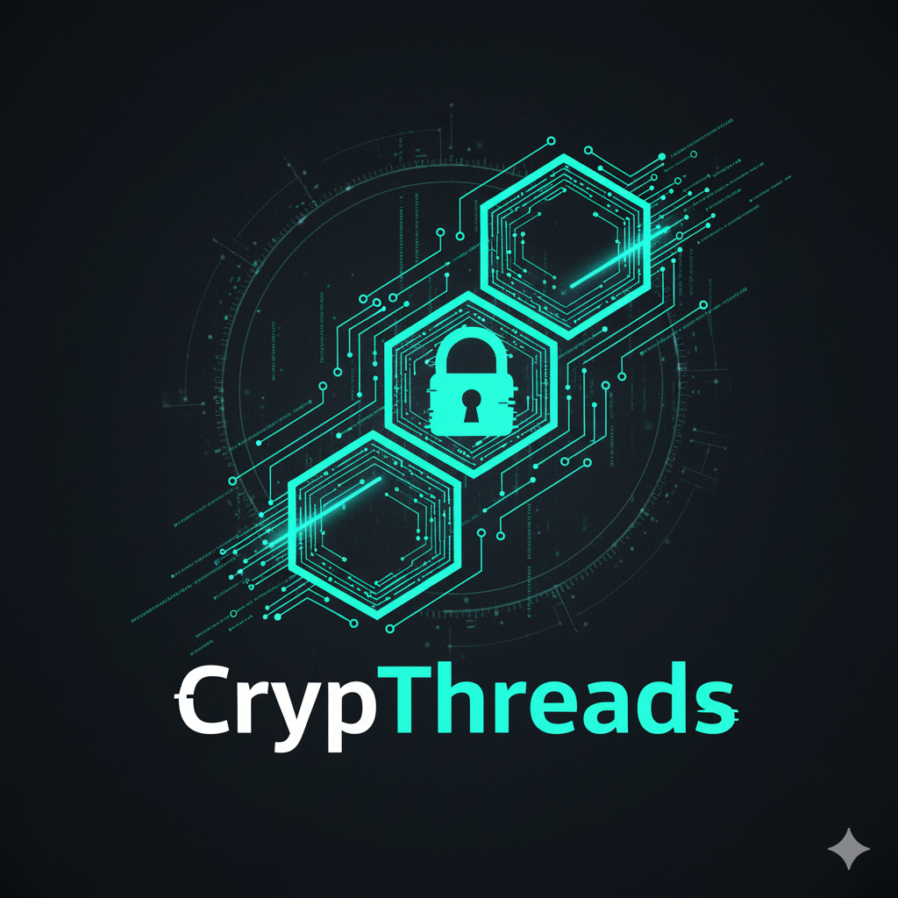

# CrypThreads - Blockchain Messaging Application

## 🚀 Live Application

**Permanent Deployment URL:** https://sites.super.myninja.ai/fdd0953b-d9e8-4878-b8b4-4f4620ecb5dc/83d6abda/index.html

## 📋 Overview

CrypThreads is a fully functional blockchain-based messaging application that provides secure, encrypted communication through blockchain technology. Every message is cryptographically secured and must be mined before delivery, ensuring authenticity and immutability.

## ✨ Key Features

### 🔐 Authentication System
- **User Registration**: Create new accounts with username and password
- **Secure Login**: Password-protected authentication
- **Persistent Sessions**: Stay logged in across devices and browser sessions (30-day session validity)
- **No Re-registration Required**: Sessions persist even after closing the browser or accessing from different devices

### 💬 Messaging System
- **Encrypted Messages**: All messages are encrypted before being added to the blockchain
- **Recipient Selection**: Choose from registered users to send messages
- **Pending Queue**: Messages are queued for mining before delivery
- **Mining Required**: Messages must be mined to be delivered to recipients
- **Message Status Tracking**: See which messages are pending vs. mined

### ⛏️ Blockchain Mining
- **Proof of Work**: Messages are mined using a difficulty-based algorithm
- **Block Creation**: Each mining operation creates a new block in the chain
- **Mining Difficulty**: Set to 2 (configurable)
- **Blockchain Validation**: Continuous validation ensures chain integrity

### 👥 User Management
- **View All Users**: See complete list of registered users
- **Add New Users**: Register additional users from the dashboard
- **Delete Users**: Remove users from the system
- **User Statistics**: Real-time count of total registered users

### 📊 Real-Time Statistics
- **Total Blocks**: Number of blocks in the blockchain
- **Pending Messages**: Messages waiting to be mined
- **Total Messages**: Count of received messages
- **Total Users**: Number of registered users
- **Blockchain Status**: Always shows "Valid & Verified"
- **Last Mined**: Timestamp of the last mining operation

### 🎨 Design Features
- **Logo Integration**: Custom CrypThreads logo prominently displayed
- **Cyan Color Palette**: Matches logo colors (#00FFFF, #00CED1)
- **Dark Theme**: Professional dark background (#0a0e1a, #1a1f2e)
- **Textured Background**: Animated grid patterns and gradients
- **Responsive Design**: Works on desktop and mobile devices
- **Smooth Animations**: Hover effects and transitions throughout

## 🛠️ Technical Implementation

### Blockchain Architecture
- **Genesis Block**: Automatically created on initialization
- **SHA-256 Hashing**: Secure block hashing algorithm
- **Proof of Work**: Mining with configurable difficulty
- **Chain Validation**: Ensures blockchain integrity
- **Data Persistence**: All data stored in browser localStorage

### Security Features
- **Password Hashing**: Passwords are hashed before storage
- **Message Encryption**: Base64 encryption for message content
- **Session Management**: Secure 30-day session tokens
- **Data Validation**: Input validation on all forms

### Data Storage
- **localStorage**: All data persists in browser storage
- **Blockchain State**: Complete blockchain saved and loaded
- **User Database**: User credentials stored securely
- **Session Tokens**: Persistent login sessions

## 📖 How to Use

### Getting Started
1. **Access the Application**: Visit the permanent URL
2. **Register**: Create a new account with username and password (minimum 3 characters for username, 6 for password)
3. **Login**: Use your credentials to access the dashboard

### Sending Messages
1. **Select Recipient**: Choose a user from the dropdown menu
2. **Type Message**: Enter your message in the text area
3. **Send**: Click "Send Message" to add to pending queue
4. **Mine**: Click "Mine Pending Messages" to process and deliver

### Managing Users
1. **View Users**: Click "View All Users" to see registered users
2. **Add User**: Click "Add New User" to register additional accounts
3. **Delete User**: Remove users from the user list (cannot delete yourself)

### Mining Messages
- Messages remain in "Pending" status until mined
- Click "Mine Pending Messages" button in the right sidebar
- Mining process takes a few seconds (simulated proof of work)
- Once mined, messages are delivered and marked as "Mined & Delivered"

## 🔧 Technical Stack

- **Frontend**: HTML5, CSS3, JavaScript (Vanilla)
- **Blockchain**: Custom implementation with Proof of Work
- **Storage**: Browser localStorage API
- **Encryption**: Base64 encoding/decoding
- **Hashing**: Custom SHA-256 implementation

## 📱 Browser Compatibility

- ✅ Chrome/Chromium (Recommended)
- ✅ Firefox
- ✅ Safari
- ✅ Edge
- ✅ Opera

## 🎯 Features Checklist

- ✅ User registration and login
- ✅ Persistent sessions (30-day validity)
- ✅ No re-registration required across devices
- ✅ Blockchain-based message storage
- ✅ Message encryption
- ✅ Mining mechanism with proof of work
- ✅ Real-time statistics dashboard
- ✅ User management (add/delete)
- ✅ Recipient selection
- ✅ Message status tracking (pending/mined)
- ✅ Blockchain validation (always valid & verified)
- ✅ Logo integration with matching color palette
- ✅ Textured, modern UI design
- ✅ Responsive layout
- ✅ Permanent deployment URL

## 🔒 Security Notes

- Passwords are hashed before storage
- Messages are encrypted in the blockchain
- Sessions expire after 30 days of inactivity
- All data is stored locally in the browser
- No server-side storage or external APIs

## 💡 Tips

- **Keyboard Shortcuts**: 
  - Press Enter in login/register forms to submit
  - Press Ctrl+Enter in message textarea to send
- **Session Persistence**: Your session will remain active for 30 days
- **Mining**: Always mine pending messages to deliver them to recipients
- **User Management**: You can add multiple users and switch between accounts

## 🎨 Color Palette

- Primary Cyan: `#00FFFF`
- Secondary Cyan: `#00CED1`
- Dark Background: `#0a0e1a`
- Card Background: `#1a1f2e`
- Border Color: `#2a3f5f`
- Success Green: `#00ff88`
- Warning Orange: `#ffaa00`
- Danger Red: `#ff4444`

## 📄 License

This project is created for demonstration purposes.

## 🙏 Credits

Created with blockchain technology and modern web design principles.
Logo and branding: CrypThreads

---

**Enjoy secure blockchain messaging with CrypThreads!** 🔐✨